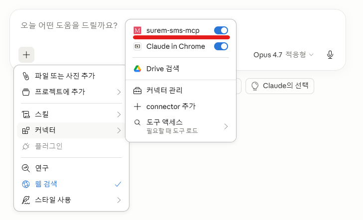

# 슈어엠 SMS MCP

Claude에게 말만 하면, 슈어엠으로 문자메시지를 보내주는 MCP 서버입니다.

```
"발신번호 15884640으로 010-0000-0000에 '오늘 저녁 7시 약속 잊지 마세요' 문자 보내줘"
```

---

## 주요 기능

- **자연어 발송** — Claude에게 대화하듯 말하면 SMS/LMS를 자동 발송
- **자동 SMS/LMS 전환** — 메시지 길이(EUC-KR 기준 바이트)에 따라 자동 선택
  - 90바이트 이하 → **SMS**
  - 91 ~ 2,000바이트 → **LMS**
- **예약 발송** — 원하는 시각 지정 (미지정 시 즉시 발송)
- **메시지 길이 검증** — 2,000바이트 초과 시 발송 전 경고
- **토큰 자동 갱신** — API 인증 토큰을 자동 캐싱/갱신

---

## 연결 방법 선택

두 가지 방법을 지원합니다. 대부분의 사용자는 **원격 연결**을 권장합니다.

| 방법 | 적합 대상 | 설치 | Claude 플랜 |
|---|---|---|---|
| 🌐 **[원격 연결](#-원격-연결-권장)** (권장) | 일반 업무 사용자 | ❌ 없음 | Pro 이상 권장 (Free는 Custom Connector 1개 제한) |
| 💻 [로컬 stdio 설치](#-로컬-stdio-설치-레거시) | 무료 플랜 / 개발자 | Node.js + config 편집 | 전체 플랜 |

---

## 🌐 원격 연결 (권장)

사내 SureM MCP 서버에 OAuth 2.1로 로그인만 하면 바로 사용. 개별 PC에 Node.js 설치나 설정 파일 편집이 필요 없습니다.

### 사전 준비

1. **슈어비즈 계정** — [surebiz.co.kr](https://surebiz.co.kr) 회원가입
2. **SecretKey 발급** — 로그인 후 **기본정보 → 내정보 → 최하단 'REST API 인증키'** 메뉴에서 발급
3. **발신번호 등록** — **기본정보 → 발신번호** 에서 사용할 발신번호 등록
4. **MCP 커넥터 URL** — `https://mcp.surem.com/mcp`

> ℹ️ 원격 연결 방식에서는 **개인 PC의 IP 등록이 불필요**합니다. 서버의 고정 IP가 슈어엠 API에 이미 등록되어 있습니다.

### 연결 절차

1. Claude Desktop 실행 → **설정 → 커넥터 관리 → + Custom connector 추가**
2. 이름은 자유롭게 설정(예: **surem-sms-mcp**), URL 입력란에는 `https://mcp.surem.com/mcp` 입력 후 **추가**
3. **연결** 버튼을 누르면 자동으로 열리는 브라우저 창에 **UserCode(슈어엠 아이디)** 와 **SecretKey** 입력 후 로그인
4. Claude Desktop으로 자동 복귀 → 커넥터 목록에 `surem-sms-mcp` 활성화 확인

#### 📹 설정 가이드 (애니메이션)


#### ✅ 연결 완료 화면



이제 [사용 방법](#사용-방법) 으로 이동하세요.

---

## 💻 로컬 stdio 설치 (레거시)

> 💡 이 경로는 **Claude 무료 플랜 사용자**나 **로컬 개발/테스트** 환경에서 사용합니다. 원격 연결이 가능하면 그쪽을 권장합니다.

<details>
<summary><b>설치 4단계 펼치기</b></summary>

### 1단계. 필수 프로그램 설치

| 프로그램 | 설명 |
|---|---|
| [Claude Desktop](https://claude.ai/download) | 클라이언트 |
| [Node.js](https://nodejs.org) | v16 이상 |

확인:

```bash
node --version
```

### 2단계. 슈어비즈 회원가입 및 SecretKey 발급

[surebiz.co.kr](https://surebiz.co.kr) 회원가입 → 로그인 → **기본정보 → 내정보 → REST API 인증키** → SecretKey 발급. UserCode와 SecretKey 메모.

### 3단계. IP 등록 및 발신번호 등록

로컬 설치는 **본인 PC의 IP** 가 슈어엠 API에 등록되어 있어야 합니다.

**3-1. 내 PC의 IP 등록**

1. [네이버](https://naver.com) 검색창에 **내 IP주소** 입력해 공인 IP 확인
2. 슈어비즈 → **기본정보 → 고객지원 → IP관리** 에서 해당 IP 등록

> IP 미등록 시 "HTTP 403" 오류 발생

**3-2. 발신번호 등록**

슈어비즈 → **기본정보 → 발신번호** 에서 사용할 발신번호 등록 (심사 완료 후 사용 가능).

### 4단계. MCP 설치

OS에 맞는 자동 설치 스크립트를 실행합니다.

**🪟 Windows (PowerShell)**

```powershell
iex ((irm https://raw.githubusercontent.com/suremapp/surem-sms-mcp/main/scripts/install-windows.ps1).TrimStart([char]0xFEFF))
```

실행하면 **UserCode** 와 **SecretKey** 를 순서대로 물어봅니다.

> `.TrimStart([char]0xFEFF)` 는 스크립트 파일의 UTF-8 BOM 제거용입니다. BOM 은 PS 5.1 의 한글 파싱용으로 필요하지만 `irm | iex` 에서는 방해됩니다.

저장소를 로컬에 clone 한 경우엔 인자로 직접 전달도 가능:

```powershell
.\scripts\install-windows.ps1 -UserCode "슈어엠_아이디" -SecretKey "API_키"
```

**🍎 Mac (터미널)**

```bash
curl -s https://raw.githubusercontent.com/suremapp/surem-sms-mcp/main/scripts/install-mac.sh | bash
```

값을 한 줄에 함께 전달:

```bash
curl -s https://raw.githubusercontent.com/suremapp/surem-sms-mcp/main/scripts/install-mac.sh | bash -s 슈어엠_아이디 API_키
```

**✏️ config 직접 설정**

Claude Desktop 의 `claude_desktop_config.json` 에 직접 추가:

| OS | 경로 |
|---|---|
| Windows (Microsoft Store) | `%LOCALAPPDATA%\Packages\Claude_pzs8sxrjxfjjc\LocalCache\Roaming\Claude\claude_desktop_config.json` |
| Windows (일반 설치) | `%APPDATA%\Claude\claude_desktop_config.json` |
| Mac | `~/Library/Application Support/Claude/claude_desktop_config.json` |

```json
{
  "mcpServers": {
    "surem-sms-mcp": {
      "command": "npx",
      "args": ["-y", "surem-sms-mcp"],
      "env": {
        "SUREM_USER_CODE": "슈어엠_아이디",
        "SUREM_SECRET_KEY": "API_키"
      }
    }
  }
}
```

### 설치 확인

1. Claude Desktop **완전 종료 후 재시작** (트레이 아이콘 포함)
2. 채팅창 **+ 버튼 → 커넥터** 에서 `surem-sms-mcp` 활성화 확인

</details>

---

## 사용 방법

Claude에게 자연어로 말하면 됩니다. **발신번호는 반드시 슈어비즈에 사전 등록된 번호**여야 합니다.

### 예시

```
"발신번호 15884640으로 010-0000-0000에 '내일 오전 10시 미팅입니다' 문자 보내줘"
```

```
"010-0000-0000에 배송 완료 안내 문자 보내줘. 발신번호는 15881234야."
```

```
"아래 내용으로 LMS 발송해줘.
 받는 사람: 010-0000-0000
 발신번호: 15884640
 제목: 주문 확인
 내용: 주문하신 상품이 오늘 출고됩니다. 감사합니다."
```

> 메시지 길이가 길면 자동으로 **LMS**로 전환됩니다. 별도 지시 불필요.

### 예약 발송

시각을 지정하면 예약 발송됩니다.

```
"내일 오전 9시에 010-0000-0000로 '좋은 아침입니다' 문자 보내줘. 발신번호는 15884640."
```

```
"2026년 4월 25일 오후 2시 30분에 010-0000-0000에 세미나 안내 LMS 예약 발송해줘.
 발신번호: 15884640
 제목: 세미나 안내
 내용: 오늘 오후 3시 3층 대회의실에서 세미나가 진행됩니다."
```

> ⚠️ **예약 취소는 슈어비즈 사이트에서 수동으로**: 슈어비즈 → **예약,결과 → 예약조회** 메뉴에서 취소

---

## 제공 도구 (Tools)

### `send_message`

수신번호, 내용, 발신번호를 받아 SMS 또는 LMS로 발송. 메시지 길이에 따라 타입 자동 선택.

| 파라미터 | 필수 | 설명 |
|---|:---:|---|
| `to` | ✅ | 수신자 전화번호 (예: `01012345678`) |
| `text` | ✅ | 발송할 메시지 내용 |
| `reqPhone` | ✅ | 발신번호 (슈어비즈에 사전 등록된 번호, 예: `15884640`) |
| `subject` | ⬜ | LMS 제목 — 90바이트 초과로 LMS 전환 시 사용 (기본값: `메시지`) |
| `reservedTime` | ⬜ | 예약 발송 시각 — `yyyyMMddhhmmss` 14자리 (예: `20260420150000`). 미입력 시 즉시 발송 |

발송 결과는 슈어비즈 **결과조회** 메뉴에서 확인. 예약 취소는 **예약,결과 → 예약조회** 에서.

---

## 자주 묻는 질문

<details>
<summary><b>원격 연결 / 로컬 설치 중 뭘 써야 하나요?</b></summary>

- **일반 업무 사용자(영업/마케팅 등)**: 원격 연결. 설치·설정 필요 없음.
- **Claude 무료 플랜이라 Custom Connector 를 쓸 수 없거나 이미 다른 커넥터를 쓰고 있는 경우**: 로컬 stdio.

</details>

<details>
<summary><b>SureM 에서 SecretKey 를 재발급 받았어요 — 어떻게 갱신하나요?</b></summary>

관리자 개입 없이 사용자가 직접 갱신 가능합니다:

1. 브라우저에서 **`https://mcp.surem.com/account`** 접속
2. **UserCode** 와 **새 SecretKey** 입력 후 제출
3. 서버가 슈어엠 API 로 검증 통과 → DB 에 즉시 반영
4. Claude Desktop 그대로 사용하면 다음 문자 발송부터 **새 SecretKey 로 자동 전송**됩니다 (재로그인 불필요)

> UserCode 가 처음 쓰는 경우라도 이 페이지로 등록 가능합니다. 이후 Claude Desktop OAuth 로그인 폼도 스킵되고 바로 사용 가능.

</details>

<details>
<summary><b>"인증 실패" / "403" 오류가 발생해요</b></summary>

**원격 연결**

- 브라우저에 재로그인 (쿠키 만료 가능)
- UserCode·SecretKey 가 현재 유효한지 슈어비즈 로그인으로 확인

**로컬 설치**

- SecretKey 입력 오류
- 현재 PC 의 **공인 IP** 가 슈어비즈에 등록되어 있는지 (VPN/테더링/사무실 이전 시 변경 가능)
- `SUREM_USER_CODE` 가 실제 **슈어엠 아이디** 인지

</details>

<details>
<summary><b>"요청 성공인데 문자가 오지 않아요"</b></summary>

발송 요청은 성공했지만 실제 수신이 되지 않는 경우:

1. 슈어비즈 **결과조회** 메뉴에서 실패 사유 확인
2. 실패 사유 후보:
   - 발신번호 미등록 / 승인 대기
   - 수신자의 **080 수신거부** 등록
   - 이동통신사 스팸 필터링
   - 잘못된 수신번호 형식

</details>

<details>
<summary><b>"메시지가 너무 깁니다" 오류가 발생해요</b></summary>

EUC-KR 기준 최대 **2,000바이트** 까지 발송 가능합니다. 한글은 1글자 = 2바이트이므로 약 1,000자 한계.

</details>

<details>
<summary><b>Claude Desktop 커넥터 목록에 나타나지 않아요</b></summary>

**공통**

- Claude Desktop 완전 종료 후 재시작 (트레이 아이콘까지)

**원격 연결**

- URL 을 HTTPS 로 정확히 입력했는지
- 관리자에게 MCP 서버 상태 확인 요청

**로컬 설치**

- `claude_desktop_config.json` 의 JSON 문법이 올바른지
- Node.js 설치 및 `node --version` 동작 확인
- `npm cache clean --force` 후 재시작

</details>

<details>
<summary><b>예약 발송을 취소하고 싶어요</b></summary>

MCP 에서는 예약 취소를 제공하지 않습니다. 슈어비즈에서 직접 취소:

1. [슈어비즈](https://surebiz.co.kr) 로그인
2. **예약,결과 → 예약조회** 진입
3. 건 선택 후 취소

</details>

<details>
<summary><b>(로컬 설치) 업데이트했는데 이전 버전처럼 동작해요</b></summary>

Claude Desktop 이 MCP 서버의 캐시된 버전을 재사용합니다:

1. **(가장 간단)** 채팅창 **+ 버튼 → 커넥터** 에서 `surem-sms-mcp` 토글 off → on
2. Claude Desktop 완전 종료 후 재시작
3. npm 캐시 정리:

```powershell
npm cache clean --force
Remove-Item -Recurse -Force "$env:LOCALAPPDATA\npm-cache\_npx" -ErrorAction SilentlyContinue
```

</details>

---

## 라이센스

Copyright © 2026 SureM Co., Ltd. All Rights Reserved.

본 소프트웨어는 SureM Co., Ltd.의 독점 소유물입니다. 자세한 이용 조건은 [LICENSE](./LICENSE) 파일을 참고하세요.

---

## 문의

- **슈어엠 고객센터**: 1588-4640
- **이메일**: suremapp@surem.com
- **홈페이지**: [surebiz.co.kr](https://surebiz.co.kr)
